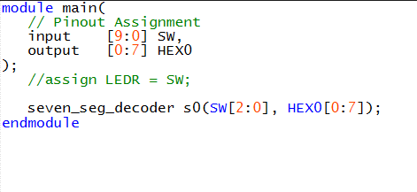

# Lab 1

## Table of Contents
- [Part 1 – Initialize switches and connect them to LEDs](#part-1)
- [Part 2 – Create an 8-bit 2-to-1 multiplexer](#part-2)
- [Part 3 – Create a 3-bit 5-to-1 multiplexer](#part-3)
- [Part 4 – Create a seven-segment display decoder module](#part-4)
- [Part 5 – Create a rotating 5-letter word with the 7 segment displays](#part-5)

---

## Part 1
#### Initialize switches and connect them to LEDs
The switches and LEDs are initialized in the top module, then connected with an `assign` statement.

When pushed to the FPGA board (the Intel DE10-Lite), this results in the ten switches turning on their corresponding red LEDs.

## Part 2
#### Create an 8-bit 2-to-1 multiplexer
- *Importantly, the DE10 only has 10 switches, so an 8-bit multiplexer is not testable with the provided board. A 4-bit multiplexer was tested instead.*

To design an n-bit multiplexer, first a submodule must be designed that functions as a 1-bit 2-to-1 multiplexer:

This submodule can then be used to create larger multiplexers in the following configuration:

 

In Verilog:

This functions as a 4-bit 2-to-1 multiplexer as expected-- when uploaded to the DE10, two 4-bit numbers are represented on the switches, and which 4-bit number gets displayed on the four LEDs depends on the select bit.

## Part 3
#### Create a 3-bit 5-to-1 multiplexer
- *Again, this won't be possible to synthesize on the boards we have, so the 1-bit 5-to-1 multiplexer is tested instead*

Similar to in Part 2, a multi-bit multiplexer needs to be constructed from a 1-bit submodule with the same functionality:

  

A 3-bit version can be created in the same way as the 8-bit in Part 2:

This cannot be connected to the top module because of the capabilities of the DE10, so testing the 1-bit instead:

This uses switches 9-7 as select bits and 6-2 as the data bits. LED0 displays the selected of the 5 bits.

## Part 4
#### Create a seven-segment display decoder module

This task is more complicated than the previous ones, so some work was done beforehand to flesh out the truth table for the decoder:

| s2 | s1 | s0 | m0 | m1 | m2 | m3 | m4 | m5 | m6 | m7 | Character |
|----|----|----|----|----|----|----|----|----|----|----|-----------|
| 0  | 0  | 0  | 1  | 0  | 0  | 1  | 0  | 0  | 0  | 1  | H         |
| 0  | 0  | 1  | 0  | 1  | 1  | 0  | 0  | 0  | 0  | 1  | E         |
| 0  | 1  | 0  | 1  | 1  | 1  | 0  | 0  | 0  | 1  | 1  | L         |
| 0  | 1  | 1  | 0  | 0  | 0  | 0  | 0  | 0  | 0  | 1  | O         |
| 1  | 0  | 0  | 1  | 1  | 1  | 1  | 1  | 1  | 1  | 1  |           |
| 1  | 0  | 1  | 1  | 1  | 1  | 1  | 1  | 1  | 1  | 1  |           |
| 1  | 1  | 0  | 1  | 1  | 1  | 1  | 1  | 1  | 1  | 1  |           |
| 1  | 1  | 1  | 1  | 1  | 1  | 1  | 1  | 1  | 1  | 1  |           |

**Table 1- Truth Table for Character Decoder**

----------------------------
Using lookup tables, this can be translated into 7 logic circuits, which I then designed in Logisim:

 Translated into a Verilog submodule:

 

 And connected to three switches and the eight pins of the seven-segment display:

 

When this is uploaded to the FPGA board, the character decoder works- switches 2-0 work as s[2:0] and display the correct letter on the HEX0 display.

## Part 5

#### Create a rotating 5-letter word with the 7 segment displays

- *One modification was made to the original intentions because of the lack of switches on the given FPGA board-- the letters are preset*

The following table shows the arrangement of letters based on the three select bits, which are going to be SW[2:0] instead of SW[17:15].

To implement this, five instances of the following circuit diagram are needed-- notably without switches being attached to the multiplexer. The inputs will be hard-coded for each multiplexer.

 

Using the 3-bit 5-to-1 multiplexer from Part 3 and the seven-segment decoder from Part 4, this configuration is simple to implement in Verilog:

In this configuration, SW2-SW0 function as the three select bits for each multiplexer, and each multiplexer has the same list of characters shifted one to the left. All of the binary codes (`3'b010`) correspond to letters.

  
