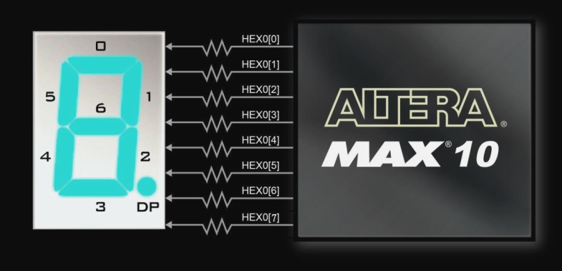
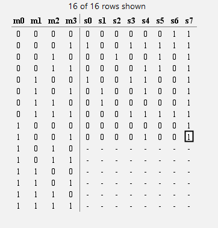
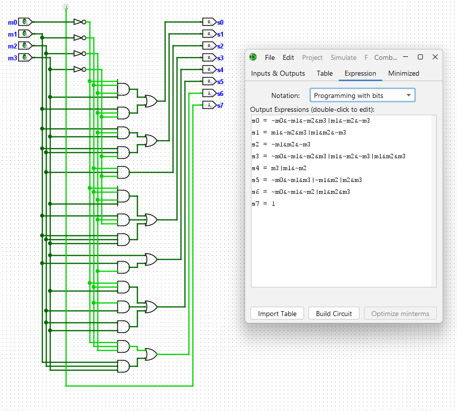

# Lab 2

## Part 1

#### Binary BCD to Seven-Segment Display Decoder

While the DE-10 Board cannot have four BCD inputs because there are only 10 switches, two must suffice. The logic can be determined from the truth table for the seven segment display, which can be assembled manually from the datasheet showing which bit turns on which segment:

 

This truth table results in the following circuit (generated from the truth table in Logisim):

