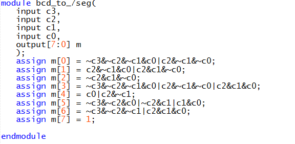
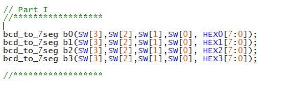

# Lab 2

## Part 1

#### Binary BCD to Seven-Segment Display Decoder

While the DE-10 Board cannot have four separate BCD inputs, they can all receive the same four bits. The logic can be determined from the truth table for the seven segment display, which can be assembled manually from the datasheet showing which bit turns on which segment:

 

This truth table results in the following circuit (generated from the truth table in Logisim):

The window on the right contains the expressions required for the Verilog code, so the BCD to Seven-Segment Display Decoder Module is simply seven assign statements with those logical statements:

Implementing in the top module:

The DE10 after uploading the code:

