# Lab 2

## Part 1

#### Binary BCD to Seven-Segment Display Decoder

While the DE-10 Board cannot have four separate BCD inputs, they can all receive the same four bits. The logic can be determined from the truth table for the seven segment display, which can be assembled manually from the datasheet showing which bit turns on which segment:

 

This truth table results in the following circuit (generated from the truth table in Logisim):

The window on the right contains the expressions required for the Verilog code, so the BCD to Seven-Segment Display Decoder Module is simply seven assign statements with those logical statements:

Implementing in the top module:

The DE10 after uploading the code:

## Part 2

#### Binary to Decimal Converter

This circuit is intended to take a 4-bit number and display it correctly in decimal on two seven-segment displays.

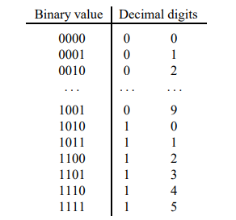

Most of the circuit is given, with three subcircuits needing to be defined:

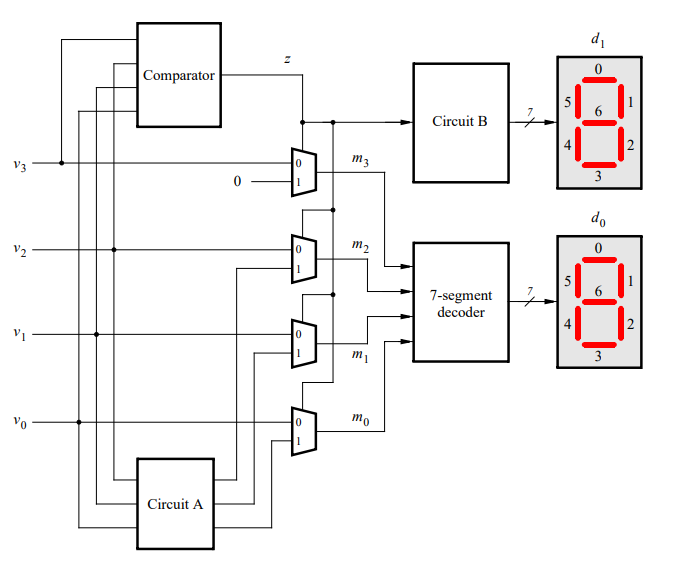 

##### Comparator

The comparator simply needs to determine if the 4-bit input number is greater than nine. The truth table for this is simple to construct:

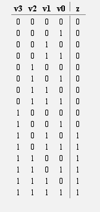

Which results in this circuit:

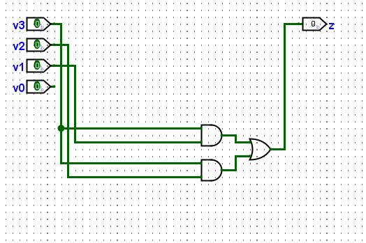 

As a Verilog module:

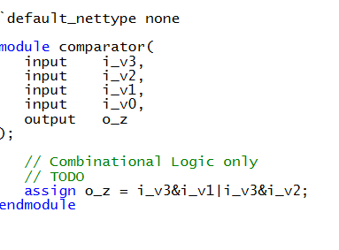

##### Circuit A

Circuit A needs to translate the second digit of the decimal number if the number is greater than nine (the select bit from the comparator is turning on all of the multiplexers). Naturally, this can be accomplished by mapping the last three binary digits to the correct three bit second digit. This happens to be subtracting (10)2 from the number:

 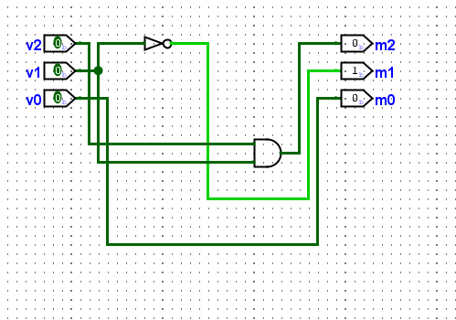 

As a Verilog module:

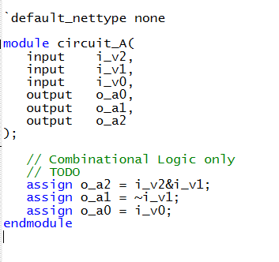

##### Circuit B

Circuit B simply needs to translate z (the output of the comparator) into its seven-segment display equivalent, which can (similarly to Part 1) be assembled manually from the chart in the data sheet:

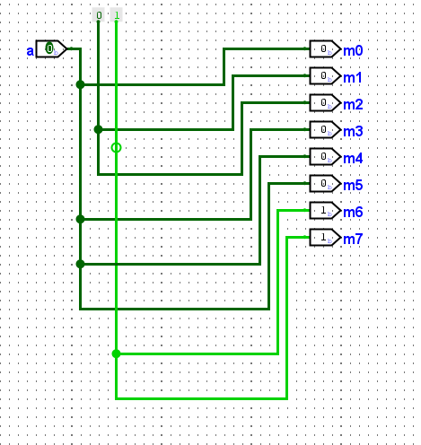 

As a Verilog module:

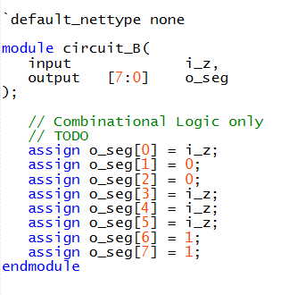

##### Integration

Putting all of these modules together with the muxes from Lab 1 and the module from Part 1, the top module is as follows:

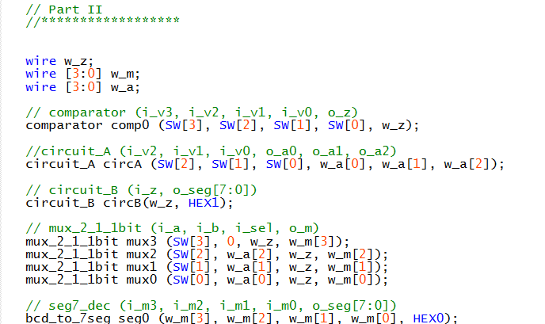

The DE10 after uploading the code:

## Part 3

#### Four Bit Addder

This part requires a ripple-carry adder built out of four full adders, a submodule that itself must be designed in Verilog.

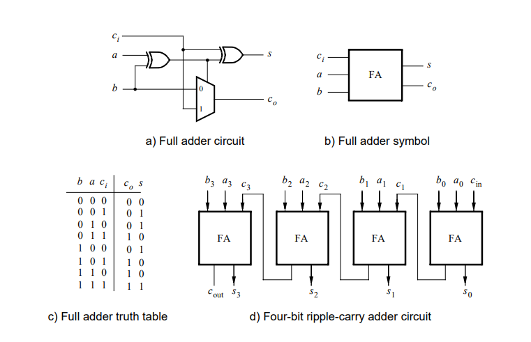

The FA submodule from the above truth table:

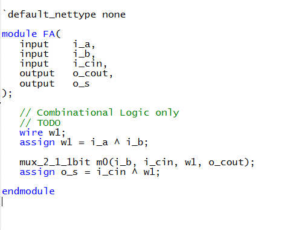 

And now connecting four of these submodules with rippling carry bits:

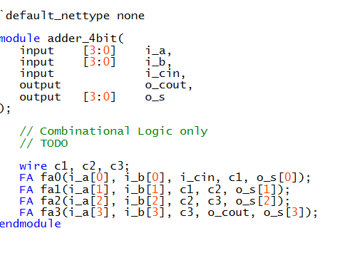 

Connecting to the top module is as simple as connecting the `adder_4bit` module to have two 4-bit switch inputs and five LED outputs, and when sent to the DE10:

## Part 4

#### Adding Two BCD Numbers

This part is just the 4-bit adder from Part 3 fed into a circuit that is very similar to Part 2 (with some modifications). For one, numbers up to 19 (9 + 9 + 1) can now be outputted, so the second digit needs to be capable of displaying as all 10 digits. Additionally, the cout bit means that some changes are required to each circuit. Lastly, a checkBCD module was implemented in order to check if the numbers inputted into the adder are both valid BCD digits.

The new full circuit design looks like the following:

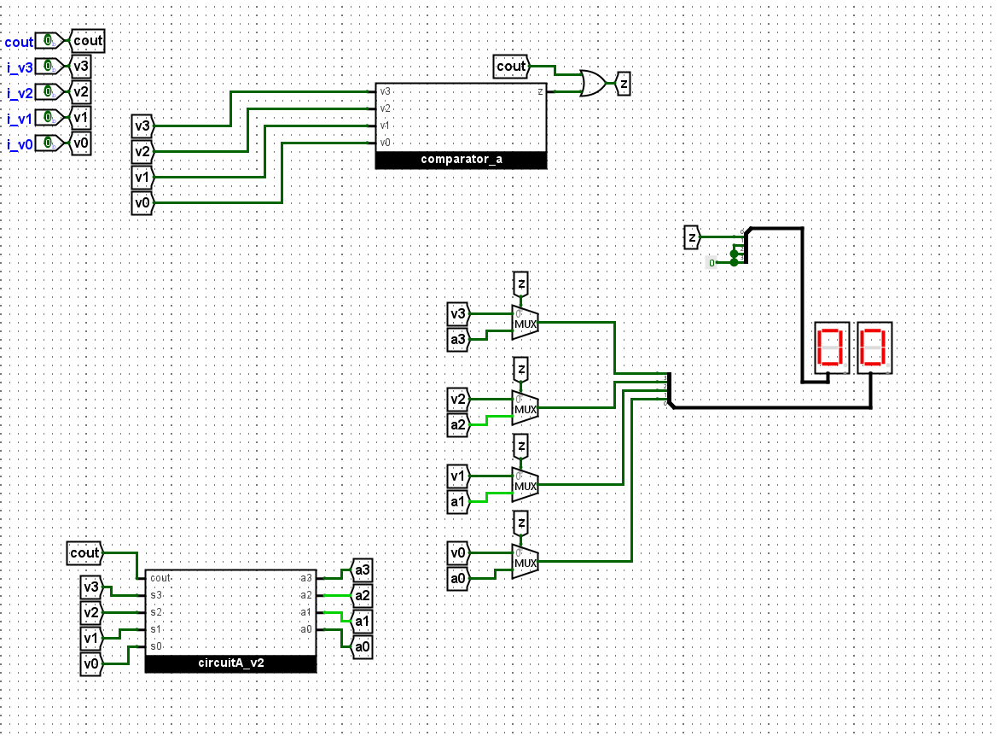

*The BCD to 7-Segment portion of the circuit was omitted in favor of Logisim's hex displays, which have the converter built in and simply take 4-bit numbers*

The two notable changes from the circuit in Part 2 are the additional input to Circuit A, which will be detailed below, and the comparator output z being OR'ed with cout. This is because the carry out being activated automatically means that the number is above 9, but would not cause that output from the comparator.

##### Circuit A v2

Circuit A must now convert the second digit of 10-19 instead of 10-15, which requires a more robust circuit with two more inputs and one more output. The same process as in Part 2 was done with the truth table (matching relevant inputs to the resulting output), which resulted in the following circuit:

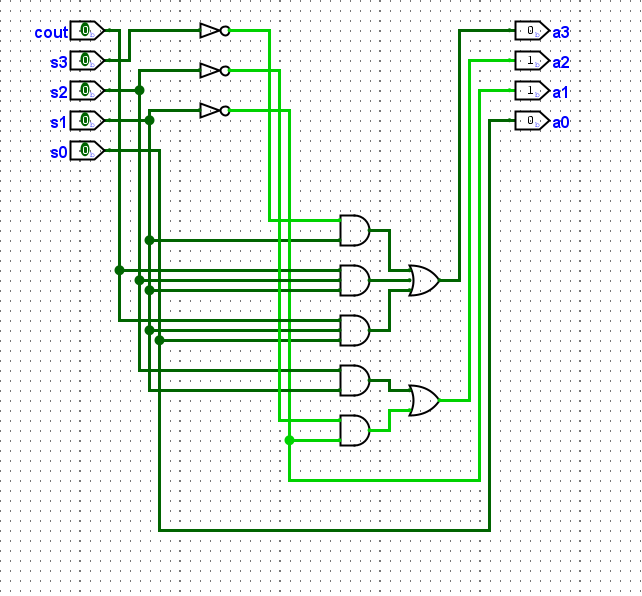

In Verilog:

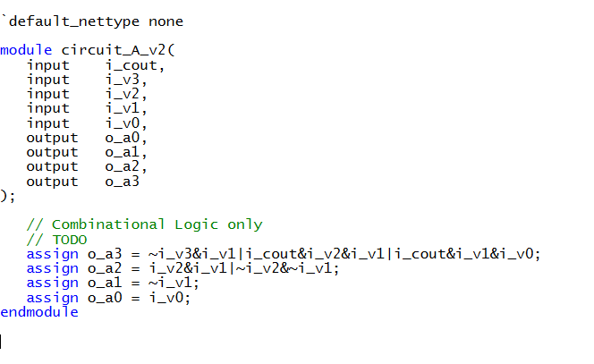

And the full submodule `bin_to_dec`:

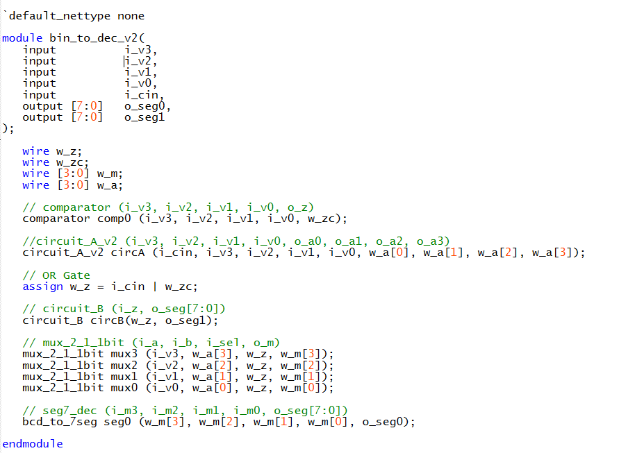

##### CheckBCD

This circuit is as simple as two of the previously designed comparators OR'ed together:

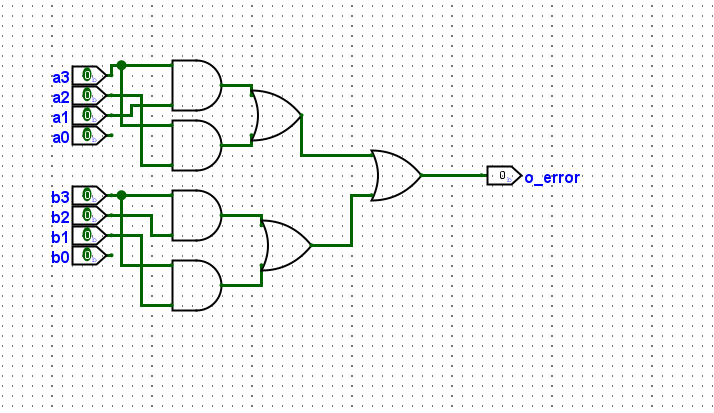

In Verilog:

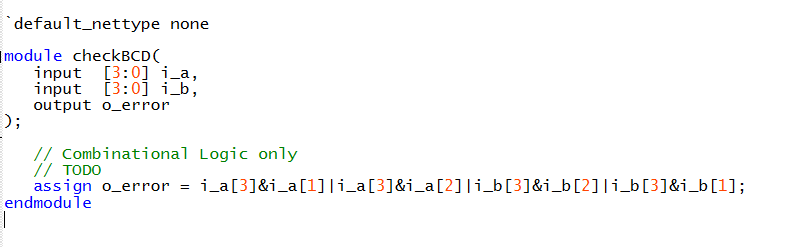

Combining these together in the top module:

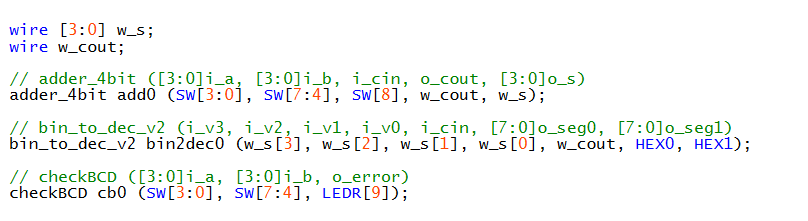

The DE10 board after uploading the code:

## Part 5

#### Adding Two 2-Digit BCD Numbers

*Since the DE10 only has 10 switches, the second 2-bit number needs to be hard-coded. 99 was chosen in order to prove the maximum case (99 + 99 + 1).*

A slightly modified version of the circuit in Part 4, one that doesn't include the BCD to 7-Segment Decoder, is used in this part. In Logisim, its name is sum_to_2digit. In Verilog, its name is bin_to_dec_v3. 

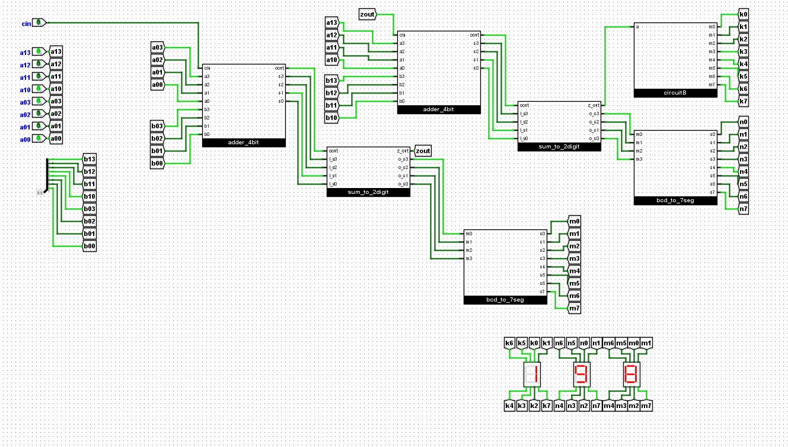

As can be seen above, the three-digit adder simply does the 4-bit adder -> BCD conversion -> 7-segment pipeline twice, then uses the same Circuit B logic for the 100's place 7-segment display. The modified sum_to_2digit can also be seen below, simply outputting the multiplexer outputs alongside z:

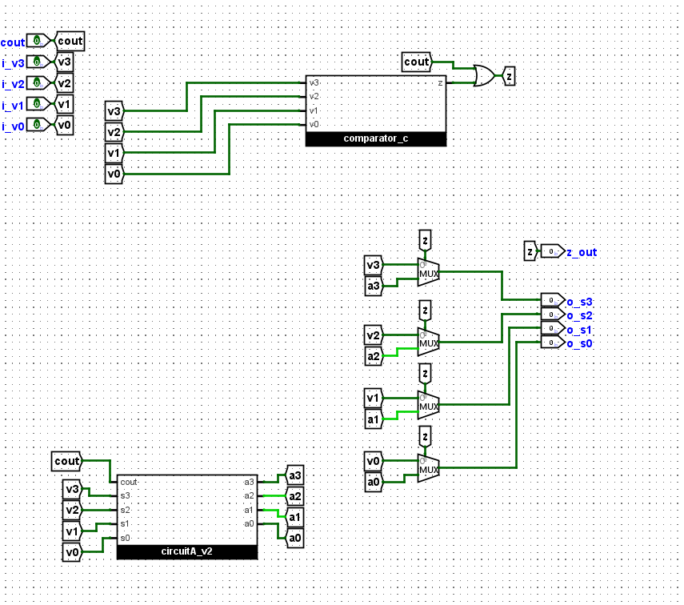

Implementing this in Verilog required creating that bin_to_dec_v3 submodule to match sum_to_2digit, which can be seen below:

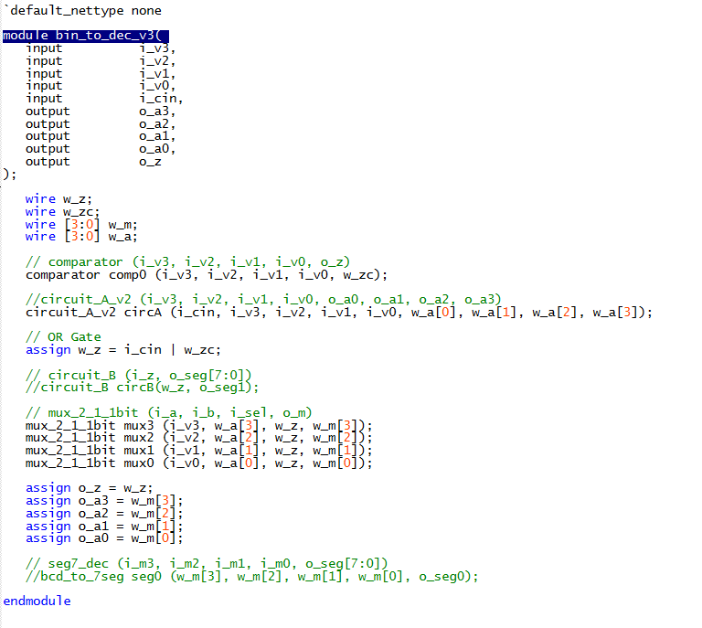

And, of course, the submodule that encapsulates the 2-digit BCD number adder:

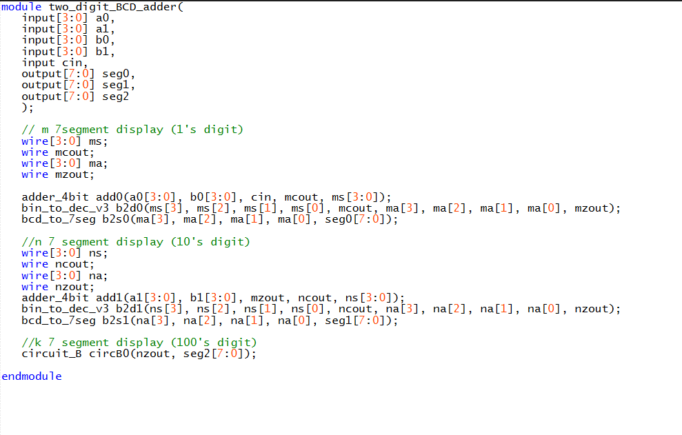

Implementing this in the top module:

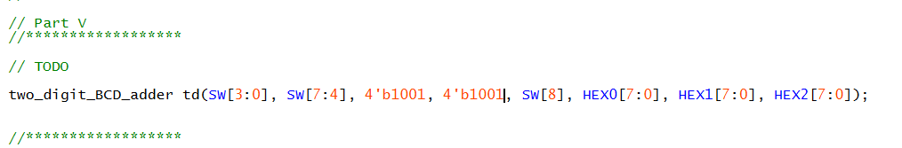

And published to the DE10 Board:

The above gif shows how SW[8:0] are added to the 99 already stored on b[7:0], to a maximum of 199.

